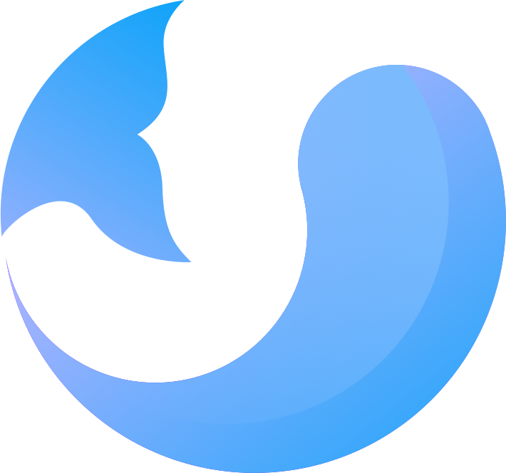
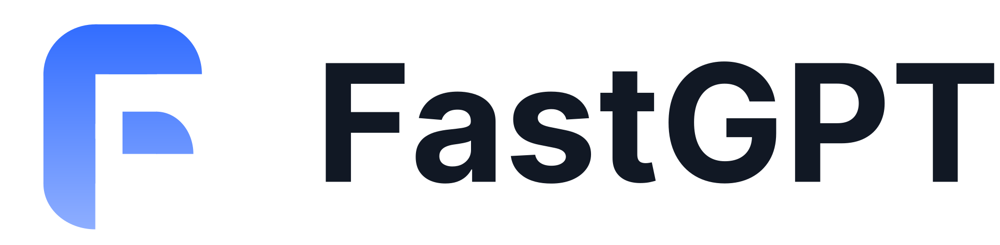

<h1 align="center">Labring</h1>

## About Us

Welcome to Labring.

We are a passionate team that develops modern technical products and shares them as open source to benefit the wider community.

## Our Projects

### Sealos
A cloud OS offering a production-ready Kubernetes distribution, designed for managing cloud-native applications.

<a href="https://sealos.io" target="_blank">Sealos.io</a> | <a href="https://github.com/labring/sealos" target="_blank">Sealos Github</a>
<picture style="height: 150">
  <source media="(prefers-color-scheme: light)" srcset="../images/sealos.svg" />
  <source media="(prefers-color-scheme: dark)" srcset="../images/sealos.svg" />
  
</picture>

### FastGPT
A powerful AI knowledge base platform, offering out-of-the-box data processing, model invocation, RAG retrieval, and visual AI workflows.

<a href="https://tryfastgpt.ai" target="_blank">TryFastGPT.ai</a> | <a href="https://github.com/labring/fastgpt" target="_blank">FastGPT Github</a>
<picture style="height: 150px">
  <source media="(prefers-color-scheme: light)" srcset="../images/fastgpt.svg" />
  <source media="(prefers-color-scheme: dark)" srcset="../images/fastgpt.svg" />
  
</picture>
